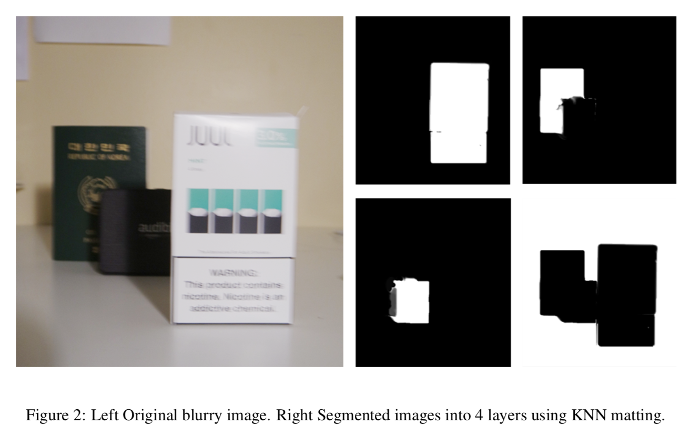
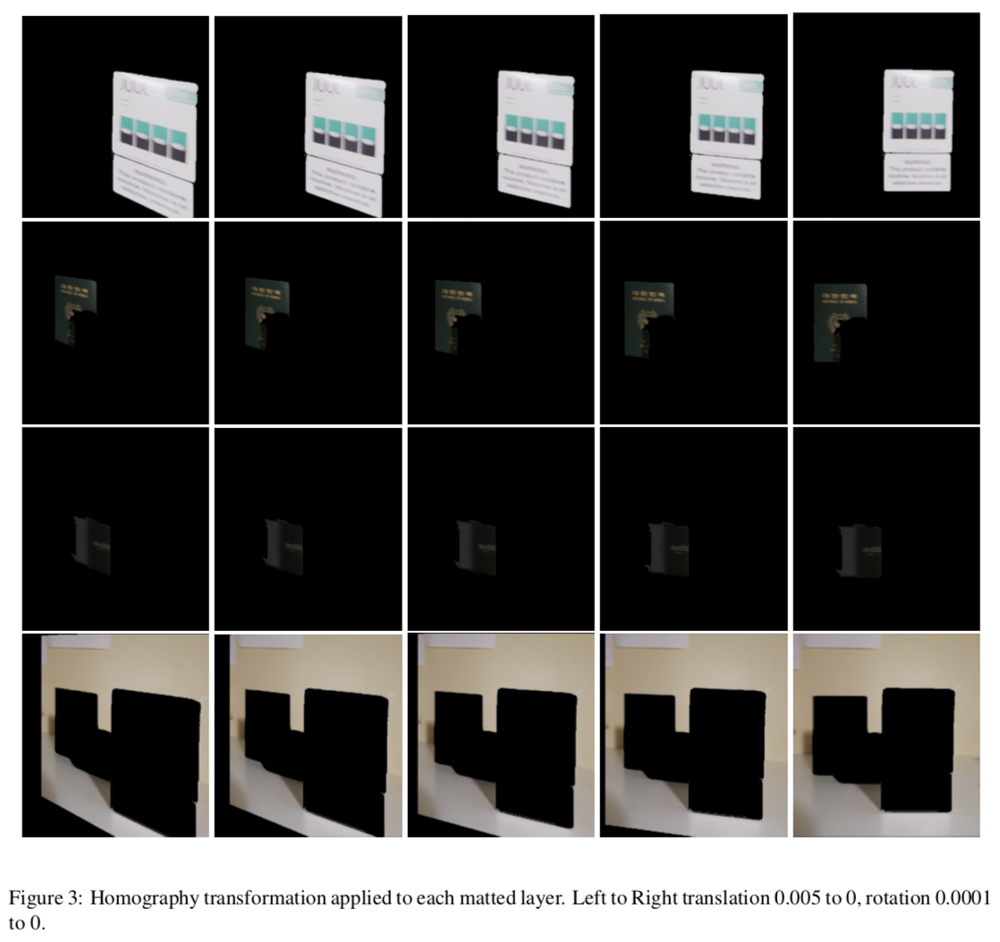

# Python+Matlab Implementation of Joint Depth Estimation and Camera Shake Removal from Single Blurry Image
Python and Matlab implementation of the paper [https://eng.ucmerced.edu/people/zhu/CVPR14_deblurdepth.pdf](https://eng.ucmerced.edu/people/zhu/CVPR14_deblurdepth.pdf).






##### Requirements

- matlab	>= 0.1
- numpy	>= 1.14.5
- scikit-image	>= 0.14.1
- scikit-learn	>= 0.19.2
- scipy	>= 1.1.0

##### Input
- Blurry image: name.jpg
- Masks: name_mask1.jpg, name_mask2.jpg, name_mask3.jpg

##### Run
```
python Deblur_Depth_Encode.py name.jpg
```

##### References
[1] Joint Depth Estimation and Camera Shake Removal from Single Blurry Image [Link](https://eng.ucmerced.edu/people/zhu/CVPR14_deblurdepth.pdf)  
[2] Fast Image Deconvolution
using Hyper-Laplacian Priors [Link](https://papers.nips.cc/paper/3707-fast-image-deconvolution-using-hyper-laplacian-priors.pdf)  
